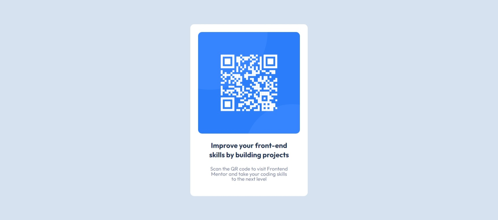

# Frontend Mentor - QR code component solution

This is a solution to the [QR code component challenge on Frontend Mentor](https://www.frontendmentor.io/challenges/qr-code-component-iux_sIO_H). Frontend Mentor challenges help you improve your coding skills by building realistic projects.

## Table of contents

- [Overview](#overview)
  - [Screenshot](#screenshot)
  - [Links](#links)
- [My process](#my-process)
  - [Built with](#built-with)
  - [What I learned](#what-i-learned)
- [Author](#author)

## Overview

### Screenshot



### Links

- Solution URL: [GitHub Repository](https://github.com/fcooantonio/qr-code-component)
- Live Site URL: [GitHub Pages](https://fcooantonio.github.io/qr-code-component/)

### Built with

- Semantic HTML5 markup
- CSS custom properties
- Flexbox

### What I learned

- I used Reset CSS to reset the browsers' default styles

```css
/* http://meyerweb.com/eric/tools/css/reset/ 
   v2.0 | 20110126
   License: none (public domain)
*/

html, body, div, span, applet, object, iframe,
h1, h2, h3, h4, h5, h6, p, blockquote, pre,
a, abbr, acronym, address, big, cite, code,
del, dfn, em, img, ins, kbd, q, s, samp,
small, strike, strong, sub, sup, tt, var,
b, u, i, center,
dl, dt, dd, ol, ul, li,
fieldset, form, label, legend,
table, caption, tbody, tfoot, thead, tr, th, td,
article, aside, canvas, details, embed, 
figure, figcaption, footer, header, hgroup, 
menu, nav, output, ruby, section, summary,
time, mark, audio, video {
	margin: 0;
	padding: 0;
	border: 0;
	font-size: 100%;
	font: inherit;
	vertical-align: baseline;
}
/* HTML5 display-role reset for older browsers */
article, aside, details, figcaption, figure, 
footer, header, hgroup, menu, nav, section {
	display: block;
}
body {
	line-height: 1;
}
ol, ul {
	list-style: none;
}
blockquote, q {
	quotes: none;
}
blockquote:before, blockquote:after,
q:before, q:after {
	content: '';
	content: none;
}
table {
	border-collapse: collapse;
	border-spacing: 0;
}
```

- I employed a ```div``` element with the class "root" to apply styles to the entire website contained within it
```html
<div class="root"></div>
```

- I used the pseudo-class ```:root``` to define global CSS variables
```css
:root {
    --white: #fff;
    --light-gray: #d6e2f0;
    --grayish-blue: #7b879d;
    --dark-blue: #1f3251;
}
```

## Author

- GitHub - [fcooantonio](https://github.com/fcooantonio)
- Frontend Mentor - [@fcooantonio](https://www.frontendmentor.io/profile/fcooantonio)
